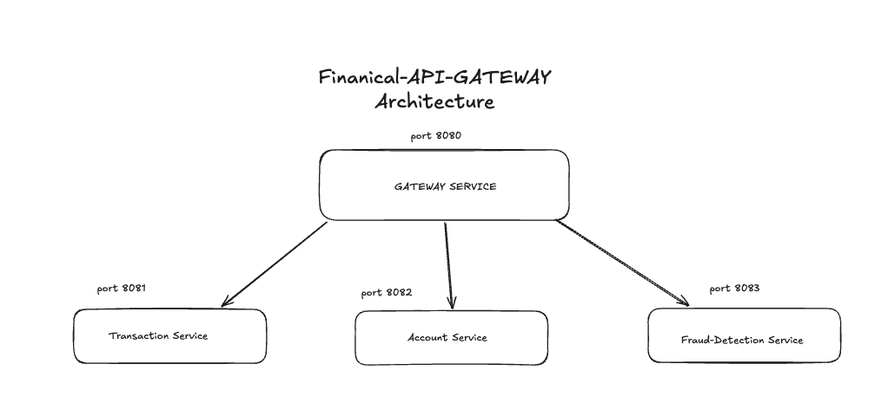
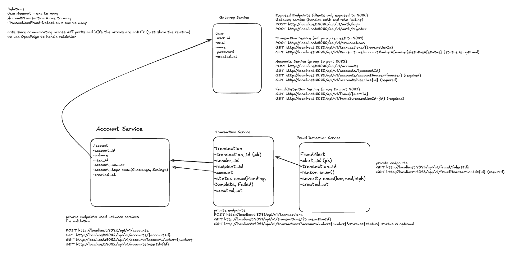
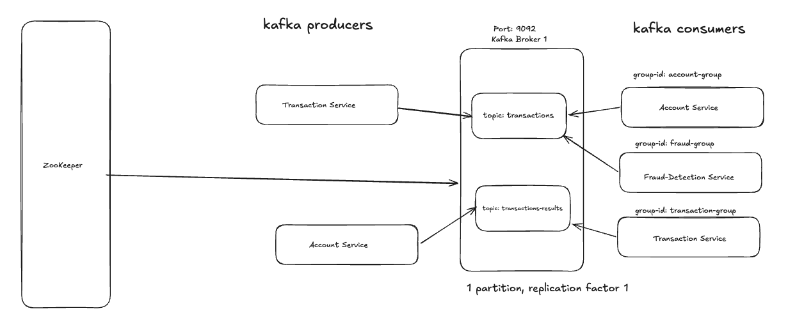

# Financial API Gateway

A microservices-based financial transaction platform demonstrating distributed systems patterns: API gateway routing, event-driven processing with Kafka, JWT authentication, distributed rate limiting, and rule-based fraud detection.

Built as a portfolio project to demonstrate backend architecture and distributed systems design. 
Took inspiration after completing J.P. Morgan simulation and decided to expand on it. This project mimics person-to-person transfers (e.g Cash App) compared to full traditional banking

## Table of Contents
- [Overview](#overview)
- [Architecture](#architecture)
- [Tech Stack](#tech-stack)
- [Getting Started](#getting-started)
- [Testing](#testing)
- [Performance & Metrics](#performance--metrics)
- [Current Limitations](#current-limitations)

## Overview

This project simulates a financial transaction system split across four independently deployable services, communicating both synchronously (REST via Feign) and asynchronously (events via Kafka). A client interacts only with a single API Gateway, which handles authentication, rate limiting, and request routing to the appropriate downstream service.

Core flow: a client creates a transaction → the Transaction Service validates the sender/recipient accounts and balance via Feign → the transaction is saved as `PENDING` and a Kafka event is published → the Account Service consumes the event and updates balances → the Fraud Service independently consumes the same event and evaluates fraud rules → the Account Service publishes a result event → the Transaction Service consumes the result and updates the transaction's final status.

## Architecture







**Request flow (synchronous):**
```
Client → Gateway (rate limit filter → JWT auth filter → routing) → downstream service
```

**Transaction flow (asynchronous, event-driven):**
```
POST /transactions → Transaction Service validates via Feign → saves PENDING
    → publishes TransactionEvent to "transactions" topic
        → Account Service consumes (group: account-group) → updates balances
            → publishes TransactionResultEvent to "transactions-results" topic
                → Transaction Service consumes (group: transaction-group) → updates status
        → Fraud Service consumes (group: fraud-group) → evaluates fraud rules
            → creates FraudAlert if flagged (no result published back)
```

Each consumer group reads the same topic independently (Account Service and Fraud Service both receive every transaction event, but are responsible for different things)

## Tech Stack

- **Backend:** Spring Boot, Spring Cloud Gateway, Spring WebFlux
- **Messaging:** Apache Kafka
- **Caching / Rate Limiting:** Redis, Bucket4j
- **Database:** PostgreSQL 
- **Inter-service Communication:** OpenFeign
- **Authentication:** JWT (JJWT)
- **Testing:** JUnit 5, Mockito, k6
- **Infrastructure:** Docker

## Getting Started

### Prerequisites
- Docker & Docker Compose
- (Optional, for local development outside Docker) Java 21, Maven

### Running locally

```bash
git clone <repo-url>
cd financial-api-gateway
```

Each service requires its own `.env.local` file (not committed to source control). See `.env.example` in each service folder for required variables (database connection, Kafka bootstrap servers, JWT secret, Redis host).

Start the full stack from the project root:

```bash
docker compose up --build
```

This starts all four services, four PostgreSQL instances, Redis, Kafka, and Zookeeper on a shared Docker network.

### Verifying it's running

```bash
# Register a user
curl -X POST http://localhost:8080/api/v1/auth/register \
  -H "Content-Type: application/json" \
  -d '{"email":"alice@test.com","password":"password123","name":"Alice"}'

# Login
curl -X POST http://localhost:8080/api/v1/auth/login \
  -H "Content-Type: application/json" \
  -d '{"email":"alice@test.com","password":"password123"}'
```

Use the returned JWT as a `Bearer` token for all subsequent requests.

**Note:** For testing/demo purposes MUST fund account via direct SQL. (see [Current Limitations](#current-limitations)).

## Testing

Unit tests focus on business logic with real branching/decision paths, rather than pass-through CRUD:

- **Fraud detection rules** — large amount, high balance percentage, unusual frequency, severity classification, idempotency
- **Account balance validation** — insufficient balance handling, account-not-found handling, successful balance updates
- **Transaction validation** — Feign-based account/balance checks, status update handling
- **JWT generation/validation** — token round-trip, expired token rejection
- **Reactive authentication flow** — login/register tested with Reactor's `StepVerifier`
- **Rate limiting** — token bucket allow/reject behavior

Run tests per service:
```bash
mvn test
```

## Performance & Metrics

**Load testing (k6)** — `POST /api/v1/transactions`, 50 concurrent virtual users, 30s duration:

| Metric | Result |
|---|---|
| Total requests | 889 |
| Success rate | 100% (0 failures) |
| Median response time | 1.19s |
| p95 response time | 5.88s |

All numbers were captured on a single local machine running the full stack (4 services, Kafka, Zookeeper, Redis, 4 PostgreSQL instances) inside Docker Desktop.
Note: latency reflects shared local hardware contention under concurrent load, not network conditions.

**Kafka end-to-end latency** — measured from event publish (Transaction Service) to balance update completion (Account Service), single-transaction trials:

| Condition | Latency |
|---|---|
| Cold start (first request after `docker compose up`) | ~1.8s |
| Steady-state average (post-warm-up) | ~492ms |

The async pipeline introduces no latency to the client-facing API response — transactions return immediately as `PENDING`. The measured latency reflects how quickly the system reaches a consistent state (balance updated, fraud evaluated) afterward, not how long the client waits.

## Current Limitations

- **Ownership-based authorization not fully enforced.** JWT authentication and role claims (USER/ADMIN) are implemented, but endpoint-level authorization currently relies on the client supplying correct path variables/query params rather than the backend verifying the authenticated user owns the requested resource (e.g., account, transaction). A production version would inject the authenticated `userId` from the JWT as a header at the gateway and verify resource ownership in each downstream service before returning data.

- **No deposit/withdrawal flow.** The system is scoped to person-to-person transfers between existing funded accounts (Cash App-style), not traditional banking with external funding sources. Account funding for testing is done via direct database seeding rather than an API endpoint, by design.

- **Fraud detection is rule-based, not ML-based.** Three simple rules (large absolute amount, high percentage of sender balance, unusual transaction frequency) are used to demonstrate the architecture and event-driven detection pattern, not to model real-world fraud detection sophistication.

- **Single Kafka broker, single partition per topic.** Sufficient for local development and demonstrating async event-driven communication; would need multiple partitions and replication factor >1 across multiple brokers for production fault tolerance and throughput.

- **No automated retry/dead-letter handling for Kafka consumer failures.** Consumers currently skip and log on missing data (e.g., account not found) rather than routing to a dead-letter topic for manual review — acceptable for this scope, but a production system would want that visibility.